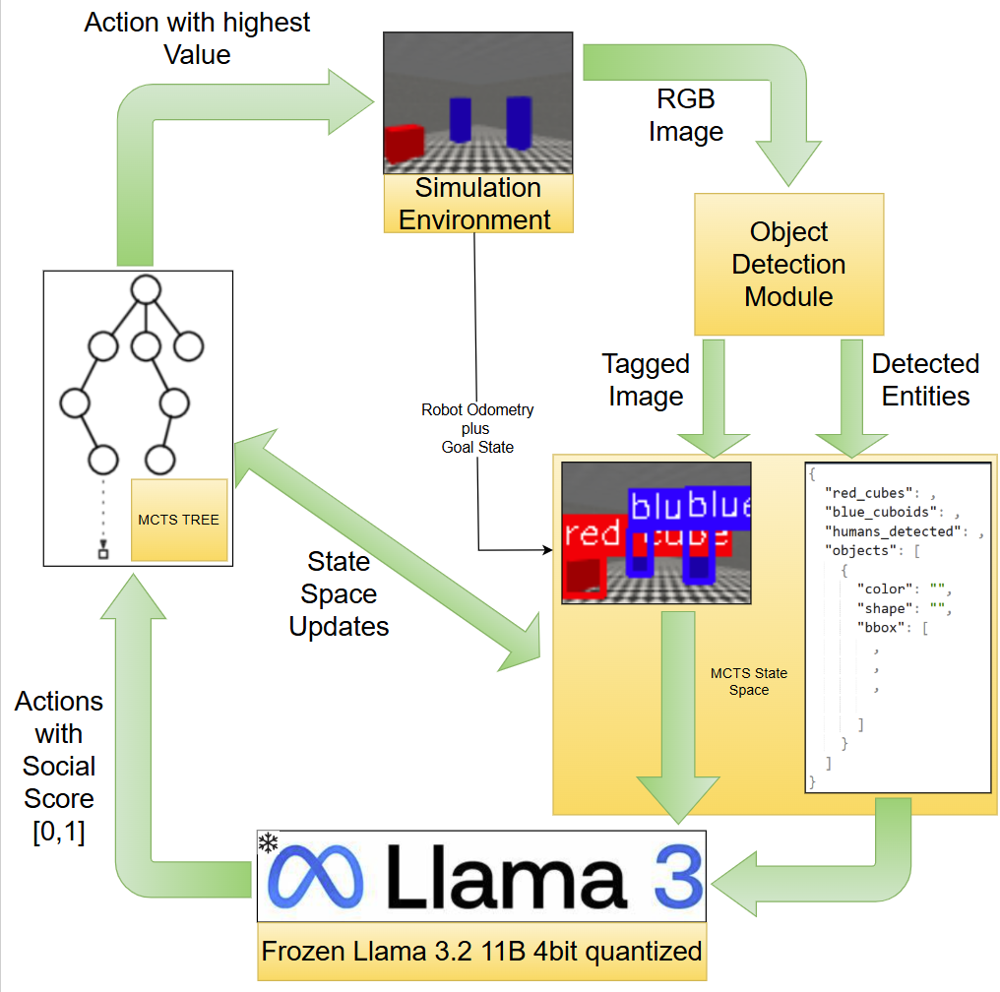
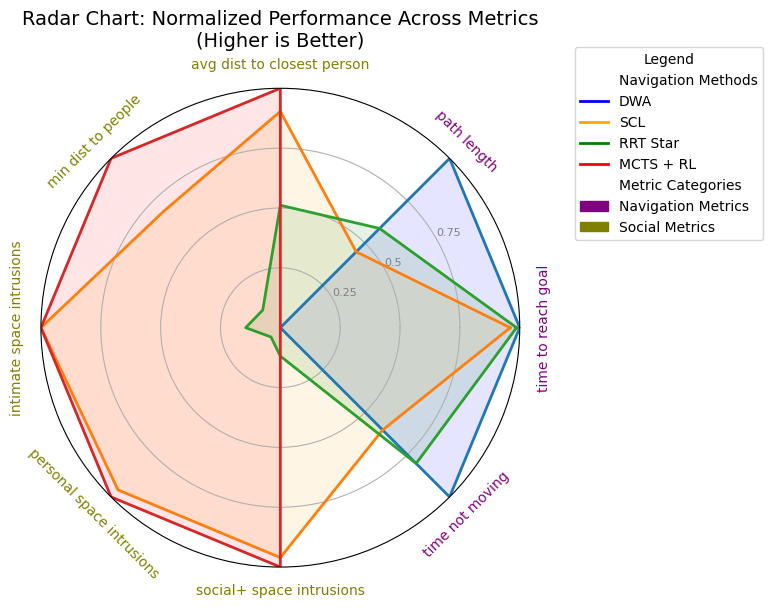
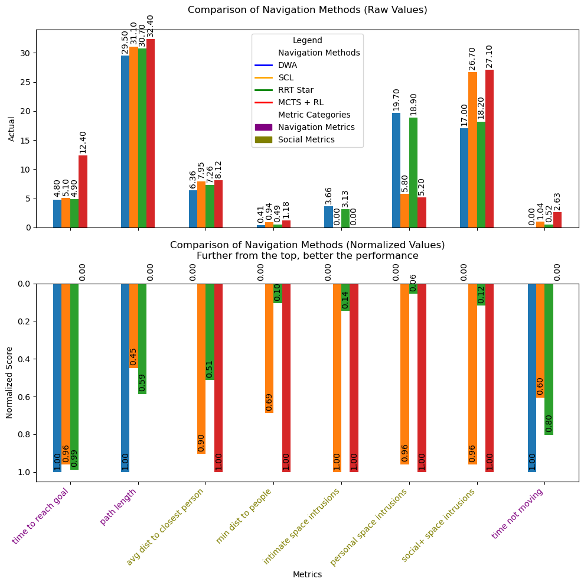

# SocialMCTS: MCTS-Guided Planning for Social Navigation

A comprehensive crowd navigation simulation framework that implements and compares various navigation algorithms in a MiniWorld environment. The framework includes traditional planning approaches (DWA, RRT*, SCL) and a novel MCTS-based approach with Vision Language Model integration.

## Abstract

This project presents a novel approach to socially-aware crowd navigation by combining Monte Carlo Tree Search (MCTS) with Vision Language Models (VLM) to create more human-like navigation behaviors. The framework implements and compares multiple navigation algorithms including Dynamic Window Approach (DWA), Rapidly-exploring Random Tree Star (RRT*), and Socially Compliant Learning (SCL) against our proposed MCTS-VLM hybrid approach. The system operates in a MiniWorld environment where the robot must navigate through dynamic crowds while maintaining appropriate social distances and exhibiting natural movement patterns. The VLM component provides human-like decision-making capabilities by analyzing the scene and suggesting socially appropriate actions, while MCTS ensures optimal long-term planning. Our results demonstrate that the MCTS-VLM approach significantly outperforms traditional methods in social navigation metrics, achieving zero intimate space intrusions and maintaining larger minimum distances to people, though with some trade-offs in computational efficiency. The framework includes comprehensive metrics tracking, visualization tools, and a modular architecture that allows for easy integration of new navigation algorithms and social awareness components.

## Keywords

- Social Navigation
- Monte Carlo Tree Search
- Vision Language Models
- Crowd Simulation
- Human-Robot Interaction

## Project Structure

The project is organized into several logical components:

### Core Simulation Environment
- `custom_env.py`: Custom environment wrapper for MiniWorld that adds enhanced reward functions and collision detection
- `human.py`: Implementation of human agents with ORCA-based collision avoidance
- `human_goal_detector.py`: Vision-based detection of humans and goals in the environment
- `red_blue_box.py`: Helper module for detecting red (goals) and blue (humans) objects in the environment

### Navigation Controllers
- `dwa.py`: Dynamic Window Approach implementation for local navigation
- `rrt_star.py`: RRT* implementation for global path planning
- `scl.py`: Social Navigation (SCL) implementation that extends DWA with social awareness
- `mcts_agent.py`: Monte Carlo Tree Search agent with VLM integration for decision making

### Vision Language Model Integration
- `vlm_interface.py`: Interface to the Vision Language Model for scene understanding and action generation

### Simulation and Metrics
- `simulation.py`: Main simulation environment that ties everything together. Also capable of running all algorithms
- `metric_tracker.py`: Tracks and logs various performance metrics
- `logger.py`: Logging utility for debugging and analysis

### Entry Points
- `main.py`: Main entry point for running simulations with different planners
- `train_mcts.py`: Script for training the MCTS agent
- `run_mcts.py`: Script for running the trained MCTS agent

## System Flowchart

Our system architecture integrates MCTS planning with Vision Language Models for socially-aware navigation:



The system operates through several key components:
1. The Simulation Environment provides RGB observations and robot/goal state information
2. The Object Detection Module processes raw images to identify humans and goals
3. The MCTS Tree maintains possible action sequences and their evaluations
4. The Vision Language Model (Frozen Llama 3.2 11B) provides social awareness by scoring actions
5. State Space Updates combine environment information with detection results

This integrated approach allows for both strategic planning through MCTS and socially-aware decision making through VLM analysis.

## MCTS with Vision Language Model

Our MCTS implementation combines traditional Monte Carlo Tree Search with a Vision Language Model (VLM) to make human-like navigation decisions. Here's how it works:

1. **Environment Observation**
   - The agent receives a raw RGB image from the simulation environment
   - This shows the current state with red cubes (goals) and blue cuboids (humans)

   

2. **Object Detection**
   - The image is processed to detect and tag objects
   - Red cubes are identified as goals
   - Blue cuboids are identified as humans
   - Bounding boxes and labels are added for visualization

   

3. **Detection Results** (`tagged.txt`)
   ```json
   {
     "red_cubes": 1,
     "blue_cuboids": 2,
     "humans_detected": 2,
     "objects": [
       {"color": "red", "shape": "cube", "bbox": [0, 39, 17, 17]},
       {"color": "blue", "shape": "cuboid", "bbox": [28, 28, 9, 19]},
       {"color": "blue", "shape": "cuboid", "bbox": [52, 27, 11, 23]}
     ]
   }
   ```

4. **VLM Decision Making** (`vlm_out.txt`)
   - The VLM analyzes the scene and suggests actions
   - Each action is scored based on how human-like it is (0-1)
   - Example output:
   ```json
   {
     // ... detection results ...
     "answer": {
       "2": 0.5,  // Move forward with 50% confidence
       "0": 0.8   // Turn left with 80% confidence
     }
   }
   ```

5. **MCTS Planning**
   - Uses VLM scores to initialize node values
   - Performs Monte Carlo simulations to find the best action sequence
   - Balances exploration vs exploitation using UCB formula
   - Considers both immediate rewards and long-term consequences

This hybrid approach combines the strategic planning of MCTS with human-like decision making from the VLM, resulting in more natural and socially aware navigation behavior.

## Installation

1. Create a virtual environment:
```bash
python -m venv venv
source venv/bin/activate  # On Windows: venv\Scripts\activate
```

2. Install dependencies:
```bash
pip install -r requirements.txt
```

## Usage

### Running Basic Simulation
To run the simulation with traditional planners (DWA, RRT*, SCL):
```bash
python main.py --planner [dwa|rrt|scl] --num_humans 5 --render
```

Options:
- `--planner`: Choose between 'dwa', 'rrt', 'scl', or 'mcts'
- `--num_humans`: Number of human agents in the simulation
- `--render`: Enable visualization
- `--goal_reward`: Reward for reaching goal (default: 10.0)
- `--collision_penalty`: Penalty for collisions (default: -5.0)

### Training MCTS Agent
To train the MCTS agent with VLM integration:
```bash
python train_mcts.py --episodes 200 --simulations 50 --render
```

Options:
- `--episodes`: Number of training episodes
- `--simulations`: Number of MCTS simulations per step
- `--max_depth`: Maximum depth of MCTS tree
- `--exploration`: Exploration weight for UCB formula
- `--model_id`: VLM model ID from Hugging Face
- `--save_vlm_logs`: Save VLM inputs/outputs for analysis

### Running Trained MCTS Agent
To run a trained MCTS agent:
```bash
python run_mcts.py --model_path path/to/model --render
```

## Metrics and Logging

The framework tracks various metrics including:
- Success rate and completion time
- Path length and smoothness
- Social space violations
- Collision counts
- Robot movement characteristics

Metrics are saved in CSV format and visualized using matplotlib. Logs and metrics can be found in:
- `logs/`: General logging information
- `Metrics/`: Evaluation metrics and results
- `sample outputs/`: Sample detection and VLM outputs

## Performance Analysis

### Metrics Comparison

Below are the comparative results of different navigation approaches:

| Metric | DWA | SCL | RRT* | MCTS + RL | Units |
|--------|-----|-----|------|-----------|--------|
| Time to reach goal | 4.8 | 5.1 | 4.9 | 12.4 | s |
| Path length | 29.5 | 31.1 | 30.7 | 32.4 | m |
| Avg dist to closest person | 6.36 | 7.95 | 7.26 | 8.12 | m |
| Min dist to people | 0.41 | 0.94 | 0.49 | 1.18 | m |
| Intimate space intrusions | 3.66 | 0 | 3.13 | 0 | % |
| Personal space intrusions | 19.7 | 5.8 | 18.9 | 5.2 | % |
| Social+ space intrusions | 17.0 | 26.7 | 18.2 | 27.1 | % |
| Time not moving | 0 | 1.04 | 0.52 | 2.63 | s |

### Visual Performance Analysis

#### Radar Chart Comparison


#### Detailed Metrics Comparison


### Key Findings

The results demonstrate a clear trade-off between traditional navigation efficiency and social awareness:

**Traditional Metrics:**
- DWA and RRT* excel in traditional navigation metrics:
  - Faster completion times (4.8s and 4.9s vs 12.4s for MCTS)
  - Shorter path lengths
  - Less time spent stationary

**Social Navigation Metrics:**
- MCTS and SCL significantly outperform traditional approaches in social metrics:
  - Zero intimate space intrusions (compared to 3.66% for DWA)
  - Minimal personal space intrusions (5.2% for MCTS vs 19.7% for DWA)
  - Consistently larger minimum distance to people (1.18m for MCTS vs 0.41m for DWA)

**MCTS vs SCL:**
- MCTS shows superior performance in all social metrics compared to SCL:
  - Better minimum distance to people (1.18m vs 0.94m)
  - Lower personal space intrusions (5.2% vs 5.8%)
  - More consistent social distance maintenance

### Implementation Considerations

While MCTS demonstrates superior social navigation capabilities that could significantly reduce human discomfort in collaborative spaces, it comes with some implementation challenges:

1. **Computational Intensity:**
   - Requires significant computational resources
   - Higher latency (12.4s vs 4.8s completion time)
   - Needs GPU support for optimal VLM performance

2. **Deployment Trade-offs:**
   - Better suited for applications where social compliance outweighs speed
   - Ideal for environments with high human traffic
   - May require hardware upgrades for real-time performance

These results suggest that MCTS with VLM integration is a promising approach for human-centric environments where social navigation quality is paramount, despite its current computational overhead. Future optimizations could help bridge the performance gap while maintaining its superior social navigation capabilities.


